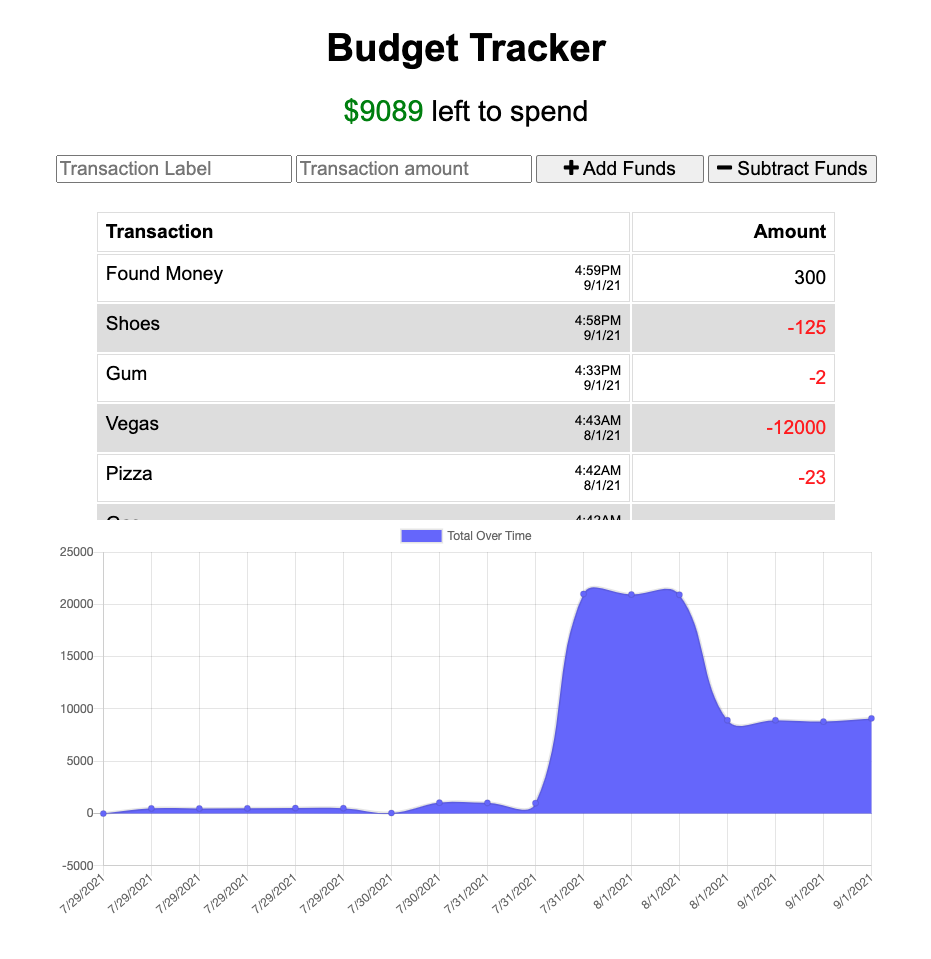

# Budget Tracker

## What is it?

Budget Tracker is a progrssive web application built to help travelers keep track of their budget while away from home -- and away from a reliable internet connection.

## What does it do?

Budget Tracker provides a simple interface for entering expenses and credits, tracks balance changes from the initial transaction, and displays a chart showing how the balance has changed over time. When used without an internet connection, the app will remember the balance from the last time it was connected to the server, and display changes relative to that balance. Transactions entered while offline are stored in the browser/client's local database (IndexedDB) and sync'ed to the server upon the next successful reconnection. The app can also be installed on a mobile device by using the "Add to Home Screen" option offered by some mobile web browsers.

## How does it work?

Budget Tracker's backend uses Node and Express, and stores transaction data in a MongoDB collection. It uses Chart.js to generate a visual representation of the budget balance over time.  When offline, a service worker is used to capture server requests and return local cached versions of assets. Transactions submitted while offline are stored in the client's built in IndexedDB and are sent to the server when a connection is reestablished. The app also provides a manifest.json file for downloading and installing it on a mobile device.

## Installing the Backend
- clone the [GitHub repository](https://github.com/costanza13/budget-tracker)
- install MongoDB on your server or local machine
- run `npm install` from the project root directory
- run `npm start`

### Packages/Modules Used
* [Express](https://www.npmjs.com/package/express)
* [MongoDB](https://www.mongodb.com/)
* [Mongoose](https://www.npmjs.com/package/mongoose)
* [compression](https://www.npmjs.com/package/compression)
* [morgan](https://www.npmjs.com/package/morgan)
* [Chart.js](https://www.chartjs.org/)

## Links
- See an example: https://budget-tracker-12hundred.herokuapp.com/
- GitHub: https://github.com/costanza13/budget-tracker